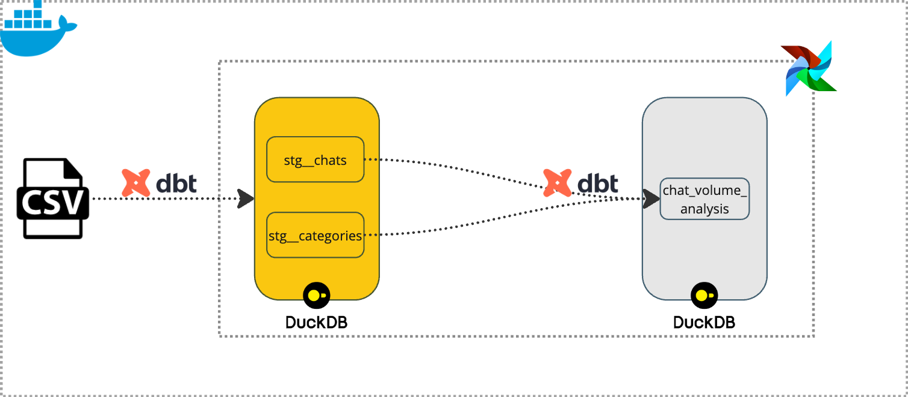
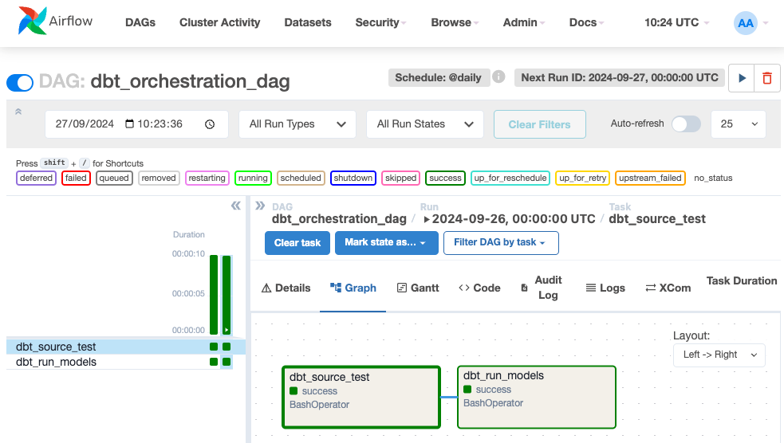
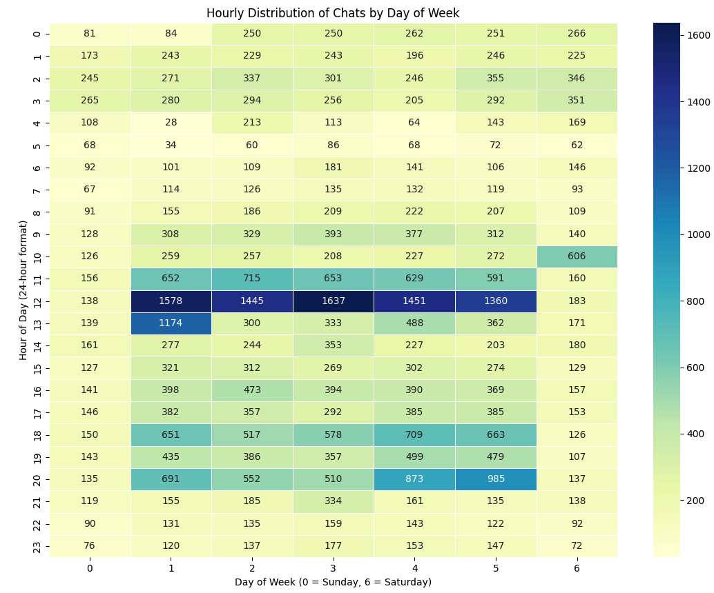

````text
     /$$   /$$ /$$$$$$$ 
    | $$  | $$| $$__  $$
    | $$  | $$| $$  \ $$
    | $$  | $$| $$$$$$$/
    | $$  | $$| $$____/ 
    | $$  | $$| $$      
    |  $$$$$$/| $$      
     \______/ |__/      
````


This project is focused on orchestrating data workflows using Airflow and dbt for efficient data pipeline management. The main objective is to perform transformations on `raw data` and ensure data quality through testing, using `DuckDB` as the underlying data warehouse. The project ingests `chats` and `categories`, transforms it into a more analyzable format, and validates the data through automated tests.

## Prerequisites

- Docker
- Docker Compose
- Python
- pip

## Installation

1. Goto the project directory:
    ```sh
    cd de-kata-main
    ```

2. Start the data pipeline:
    ```sh
    make up   # Sets up and starts the Airflow containers
    ```

3. Access the Airflow UI:
    - URL: [http://localhost:8080](http://localhost:8080)
    - Username: `airflow`
    - Password: `airflow`

4. Test dbt models locally:
    ```sh
    python3 -m venv .venv # Create a virtual environment
    source .venv/bin/activate # Activate the virtual environment
    pip3 install -r containers/requirements.txt # Install the required packages
    cd dbt # Change to the dbt directory
    ```
    ```sh
    dbt test # Runs all tests defined in the project, including source and model tests
    ```
    ```shell
    dbt test --select source:raw_layer # Runs only the tests defined in the source layer
    ```
    ```shell
    dbt test --select models/ # Runs only the tests defined in the models layer
    ```

## Architecture

- **dbt**: To transform the raw data into a more analyzable format.
- **DuckDB**: As the underlying data warehouse.
- **Airflow**: To schedule and orchestrate DAGs.
- **Postgres**: To store metadata and logs.
- **Docker**: To containerize the dbt and Airflow environment.


The use of `dbt` for data transformation ensures that the pipeline is modular and easy to maintain, while `DuckDB` provides a high-performance local data warehouse for running complex queries. `Airflow` manages orchestration, scheduling, and monitoring, while `Postgres` ensures that the metadata and logs are stored persistently. `Docker` ties everything together by providing a consistent environment for running the entire stack, ensuring that the setup is reproducible across different environments.

This architecture is highly adaptable, allowing for future growth, including the integration of new data sources, more complex transformations, or the scaling of workloads.


## Project Structure

- **DBT**: The dbt project is located in the `dbt` directory.
  - **`dbt/models`**: Contains the SQL models and tests for the dbt project.
  - **`dbt/macros`**: Contains the SQL macros used in the dbt project.
  - **`dbt/dbt_project.yml`**: Contains the dbt project configuration.
  - **`dbt/profiles.yml`**: Contains the dbt profile configuration.
- **DAGs**: The DAG for the project are defined in the `dags` directory.
  - **`dags/dbt_orchestration.py`**: Contains the DAG to orchestrate the dbt workflow.
- **Makefile**: Contains commands to manage the project.

The `anonymize_large_csv_chunked` DAG in the Airflow UI will look like the below image:


## Assumptions

1. **Handling `NULL` Values for Disabled Categories**
    - In the **categories** table, if the disabled column is `NULL` for a specific `id`, I assume that the `disabled` value from the corresponding `parent_id` should be used. For example, in the row `('161162d4-18b9-5cb0-be08-b54cbc321c37', '6c8be681-f04a-5a25-8efd-8feb0a21fc0e', None)`, since the `disabled` value for this `id` is `NULL`, we inherit the `disabled` status from its `parent_id` `('6c8be681-f04a-5a25-8efd-8feb0a21fc0e')`.
2. **Timezone Conversion for Chats**
   - The timestamps in the raw chats data are converted to AEDT (Australian Eastern Daylight Time), as customer service agents are always rostered based on Melbourne’s timezone.
3. **Separation of stg__chats and stg__categories for Chat Volume Analysis**
   - I have chosen not to combine the `stg__chats` and `stg__categories` staging tables into a single intermediate or mart table for the chat_volume_analysis. Instead, I created a single model specifically for the analysis, which joins and aggregates the necessary data from these staging tables.

## Usage

- Run Data Ingestion and Transformation with dbt:
    ```sh
    cd dbt
    dbt run && dbt test
    ```
    The raw data will be transformed and tested using dbt.

    
- Alternatively, you can trigger the DAG from the Airflow UI:
    - URL: [http://localhost:8080](http://localhost:8080)
    - Username: `airflow`
    - Password: `airflow`

## Data Governance

In managing data quality and sensitivity within a data warehouse, my approach revolves around ensuring reliability and security throughout the pipeline.

**Data Quality**:

Ensuring data quality is fundamental to the successful operation of any data warehouse. My approach begins with defining data quality checks at every stage of the pipeline—starting from the source and continuing through transformations. I implement basic integrity checks such as `unique` and `not null` validations for key fields like identifiers and timestamps to prevent incomplete or duplicate data from entering the warehouse.

In addition, I focus on enforcing referential integrity, ensuring relationships between related tables are valid (e.g., foreign keys must reference existing records). I also apply business logic checks to ensure the data aligns with expected patterns—for example, ensuring chronological accuracy between event timestamps.

These quality controls ensure that any anomalies, inconsistencies, or errors are detected early in the pipeline, reducing the risk of poor-quality data propagating downstream. Automated alerts are configured to handle errors or flag unusual patterns, allowing for quick resolution and ensuring the data remains trustworthy and fit for use by analysts, data scientists, and business teams.

**Data Sensitivity**:

In managing sensitive data, my approach revolves around minimizing exposure and ensuring secure handling throughout the data lifecycle. The first step is to identify sensitive data, such as Personally Identifiable Information `(PII)` or financial information, using techniques like pattern matching, regular expressions, or machine learning models.

Once identified, I enforce Role-Based Access Control (RBAC), limiting access to sensitive data based on roles and responsibilities within the organization. Only authorized users, such as compliance or legal teams, can access raw sensitive data, while others interact with anonymized or masked datasets. Data masking or tokenization ensures that sensitive fields are obscured before being shared or processed further, thus reducing the risk of accidental exposure.


## Quality
> 1. How would you measure the overall data quality of these files?

Data quality checks implemented at multiple stages of the pipeline to ensure the reliability and trustworthiness of the data. 
- **Source Layer**: At the source level, I have applied basic integrity checks such as:
  - **Unique Tests**: Ensuring key fields like `id` are unique.
  - **Not Null Tests**: Critical columns like `id` and `created_at` are validated to ensure they are not missing.
- **Staging Layer**: In the staging layer, I have applied more advanced checks to ensure data consistency and integrity:
  - **Referential Integrity Tests**: Ensuring relationships between the `chats` and `categories` tables are valid (e.g., each `chat_category_id` in the `chats` table must reference a valid `id` in the `categories` table).
  - **Business Logic Validation**: Applying logic checks to ensure correctness, such as ensuring that `resolved_at` is always greater than or equal to `created_at`.
   
By placing checks at both the source and staging layers, I ensure that data quality is assessed at every critical step of the pipeline, providing clean and reliable data for downstream processes.

> 2. What measures would you put in place to identify issues which would effect
data quality?

dbt tests implemented to enforce the data quality checks mentioned earlier. These tests validate key aspects across both the source and staging layers.

To handle potential issues, I’ve also configured failure thresholds. For example, in the `de_test_categories` raw file, the `disabled` field had a NULL value for one particular `id`. Instead of failing the entire pipeline, this issue was flagged and corrected during the ingestion process, ensuring the data remains usable without significant disruption.
```yaml
  - name: disabled
    description: Flag indicating if the category is disabled.
    data_type: boolean
    tests:
      - not_null:
          config:
            warn_if: ">= 1"  # Warn if there are more than 1 null values
            error_if: ">= 10"  # Fail the test if there are more than 10 null values
            severity: error  # Set severity level to error
```

For further monitoring and analysis, data profiling techniques can be employed to understand data distributions and detect anomalies early. Tools like `Soda` could be used to automate profiling, track data quality over time, and catch issues such as data drift or outliers.

> 3. What would you do with invalid data that is identified?

The approach to handling invalid data depends on the business rules and the nature of the issue. There are a few potential strategies:

1. **Stopping the Load**: If the invalid data is critical and cannot be corrected (e.g., a required field is not within accepted values), the pipeline should stop before proceeding. In this case, tests on the source data would raise an error, preventing the run from starting until the issue is resolved.

    - For example, if the `disabled` field in the `categories` table must be either `True` or `False`, the test would look like this:- 

```yaml
      - name: disabled
        description: Flag indicating if the category is disabled.
        tests:
          - accepted_values:
              values: [ True, False ]
```
2. **Fixing the Data**: If the data can be corrected (e.g., through a lookup or default value), the test at the source level might raise a warning instead of an error. The data can then be fixed during the transformation process, with further tests in place to confirm that the corrections are successful.
    
   - For example, if the `disabled` field in the `categories` table has `NULL` values, the issue can be corrected during transformation using a conditional statement like this

```sql_fluff_config
 select
        id,
        parent_id,
        case
            when
                disabled is null and parent_disabled is not null
                then parent_disabled
            else disabled
        end as disabled

```
3. **Removing Bad Data**: If the invalid data can be excluded without affecting the overall pipeline, the process can continue with only the valid data. In this case, a warning test at the source level would monitor the occurrence of invalid data, while subsequent tests ensure the processed data is clean and usable.


## Sensitivity
> 1. What measures will need to be taken in controlling access to this open text data?

1. **Role-Based Acess Control (RBAC)**
   - Implement RBAC to limit access to sensitive data based on roles. Not everyone in the company needs access to full raw data or sensitive information.
2. **Segregation of Sensitive Data**
    - Create restricted views that mask sensitive information for general users, providing limited access to open text data.
3. **Redaction of Sensitive Data**
    - Use automated processes to redact sensitive information like names, phone numbers, or email addresses before the data is made accessible to general users.

> 2. What measures would you put in place regarding its secure storage? 

Assuming the source data is in a BigQuery table, dbt is used for transformation, and Snowflake serves as the data lake, securely storing text-based PII requires several key measures. These include encryption both at rest and in transit, strict access controls, and masking or tokenizing sensitive data before storage. Secure transformations in dbt help protect the data throughout processing.

Additional security measures like dynamic data masking and column-level encryption in Snowflake safeguard sensitive data post-transformation. Finally, implementing robust retention and deletion policies reduces the risk of prolonged exposure to sensitive information.

> 3. If redaction of sensitive text was necessary, how would you tackle it?

  Assuming the data is ingested, the next step is to identify any PII. To keep things simple, I would use regular expressions to detect common PII formats such as emails, phone numbers, and credit card numbers. Once identified, the PII data is flagged for further action, after which it will be redacted. Once the sensitive information is redacted, the clean data will be securely stored in the data lake.


## Analysis Results

### Dates of Lowest and Highest Resolved Chats

| Stat Description                                  | Date        | Value |
|---------------------------------------------------|-------------|-------|
| Lowest Resolved Chats Date                        | 2000-05-04  | 15    |
| Highest Resolved Chats Date                       | 2000-03-16  | 632   |

### Median Customer-Initiated Chats Resolved per Day

| Median Chats Resolved |
|:---------------------:|
|          201          |


### Ten Most Populous Categories for Chats

| Category ID                                | Num Chats |
|--------------------------------------------|-----------|
| d4d952b3-bb65-5c41-847c-a85b47bf53ef        | 13340     |
| 87e48673-ad22-531e-aa14-8b5d66c1a46a        | 2563      |
| f98ff050-a43b-5b41-b17b-45effd6da10a        | 1602      |
| 31b66e4f-3eb4-59e0-80a5-e5b842d5749c        | 1552      |
| e3543a9c-e2b1-5d58-aede-57815cdd6d9f        | 1177      |
| f4c2db19-00da-5793-afe8-271516129549        | 731       |
| 73b43526-8307-5605-8c39-d11104d28a50        | 616       |
| 34d2cc78-08ea-5b79-b6e8-c33f4c3d11f8        | 389       |
| c5517c9c-cfad-5ff5-9eda-e42229ff6edf        | 367       |
| 2fd6739b-65ec-5cf1-a0b3-44f34477442c        | 334       |

### Ten Categories with the Lowest Resolution Rate

| Category ID                                | Resolution Rate (%) |
|--------------------------------------------|----------------------|
| 789599ea-e409-5b27-8044-dd5318073358        | 14.02                |
| 055fcaed-ed21-589e-84b2-2d41b800dcd4        | 20.83                |
| f1acb075-194a-5d2d-b91c-81d1575060a9        | 34.15                |
| f98ff050-a43b-5b41-b17b-45effd6da10a        | 51.95                |
| 34d2cc78-08ea-5b79-b6e8-c33f4c3d11f8        | 55.21                |
| 93ef56b8-6c6d-5b2c-aa39-682934cfe035        | 68.53                |
| 1353e9b1-00a7-5af5-bbab-f15fca2072b5        | 68.97                |
| f4c2db19-00da-5793-afe8-271516129549        | 73.67                |
| c5517c9c-cfad-5ff5-9eda-e42229ff6edf        | 76.62                |
| f7d4a132-1323-5301-a442-ae8034fdb6dd        | 90.45                |


### Ten Categories with the Fastest Resolution Time

| Category ID                                | Avg Resolution Time (Hours) |
|--------------------------------------------|-----------------------------|
| b5476f04-08eb-5c22-aa84-04a71ee58786        | 5.18                        |
| 436df70a-2aa8-5bbe-8119-d3ba89e2ab24        | 8.39                        |
| 732e6230-b4dc-5631-ab77-bb4f8aa5e1d7        | 9.71                        |
| 157d819a-5f4a-5064-8c87-325d3651c446        | 10.3                        |
| 9b4d4214-1972-5eec-9b58-5e8ef98c9271        | 10.49                       |
| 1353e9b1-00a7-5af5-bbab-f15fca2072b5        | 10.9                        |
| eea1b9cc-5177-55bd-af1e-b525babe64e0        | 11.18                       |
| 71e8acad-6154-5fb6-be3d-3c13cacfae8d        | 11.4                        |
| 49587e0e-32be-5a93-ba8b-a6f782f01470        | 11.48                       |
| 34d2cc78-08ea-5b79-b6e8-c33f4c3d11f8        | 11.53                       |


### Hourly Distribution of Chats by Day of Week



## Recommendations

1. ### Container Orchestration ###
    - As the number of services grows, using a container orchestration platform like `Kubernetes` becomes essential. Kubernetes provides horizontal scaling, automatic failover, and resource optimization. It allows us to dynamically scale the number of running containers (e.g., for dbt models, Airflow workers) based on current demand, ensuring efficient resource usage.

2. ### Clustered Airflow Setup ###
    - Instead of using a local Airflow instance with a `Local executor`, we can consider setting up a ``KubernetesExecutor``. This allows Airflow to distribute workloads across multiple worker nodes, making it possible to handle higher volumes of tasks and ensuring more efficient resource utilization.

3. ### Monitoring and Alerts ###
    - As the pipeline scales, ensuring proactive monitoring becomes crucial. We can implement robust monitoring and alerting systems using tools like `Prometheus`, `Grafana`, or `DataDog`. This allows us to keep track of resource usage, task execution times, and pipeline bottlenecks, helping you optimize performance before issues escalate.

4. ### Modularization and Reusability ###
    - Break down complex dbt models and DAGs into smaller, reusable modules. Modularization simplifies maintenance and testing by allowing for changes to be made to individual components without affecting the entire pipeline. This also increases flexibility in building new models and workflows, as existing components can be reused.

5. ### Data Validation and Testing ###
    - Expand on the current data validation practices by integrating continuous data quality checks using frameworks like `Great Expectations` or `SodaSQL`. These tools allow for more granular checks beyond dbt's capabilities, such as verifying data distribution, detecting anomalies, and validating adherence to business rules. We can establish `CI/CD` pipelines to automate testing and deployment of dbt models, ensuring that every change is validated before it reaches production.


